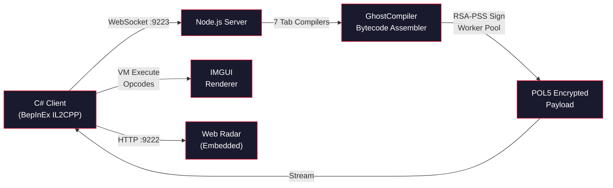

<div align="center">

<!-- Animated Header Banner -->


<!-- Typing SVG -->
<a href="https://git.io/typing-svg">
  
</a>

<br/>

<!-- Social Badges -->
<a href="https://crewcore.online" target="_blank">
  
</a>
&nbsp;
<a href="https://discord.gg/crewcore" target="_blank">
  
</a>
&nbsp;
<a href="https://www.curseforge.com/among-us/all-mods/modmenucrew" target="_blank">
  
</a>

<br/><br/>

<!-- Dynamic Badges -->

&nbsp;

&nbsp;


<br/><br/>


</div>

---

### About Me

```yaml
name: Luke Dennyel
location: Brazil
role: Independent Software Developer
focus: Game modding, reverse engineering, real-time systems
building: CrewCore — full-stack Among Us mod ecosystem (since 2025)
stack: C#/.NET (BepInEx IL2CPP) | Node.js (WebSocket + Crypto) | Python | HTML/CSS/JS
achievements: CurseForge Top 5 frontpage | Starstruck badge | 5+ years in Among Us modding
```

I'm the creator of **[CrewCore](https://crewcore.online)**, the **#1 Among Us mod** ranked [Top 5 on CurseForge](https://www.curseforge.com/among-us/all-mods/modmenucrew) — a full-stack ecosystem with **80+ features** spanning a C# BepInEx IL2CPP plugin, a Node.js real-time backend, a web platform with Stripe-powered key system, and a Python Discord bot.

What makes CrewCore different from other mods: the entire UI is **compiled server-side into signed bytecode**, streamed via WebSocket, and executed client-side by a custom IMGUI virtual machine. This means UI updates ship instantly without any client-side patches — a production architecture rarely seen in game modding.

**My journey:** Started with [CrewMod](https://github.com/MRLuke956/CrewMod) in 2021 as a small Among Us mod, evolved into the full CrewCore ecosystem by 2023, and now maintain one of the most feature-rich Among Us modding platforms available.

---

### Architecture

> How CrewCore's server-side bytecode UI pipeline works:



<details>
<summary><b>POL5 Wire Format</b></summary>

```
[MAGIC "POL5" 4B][RSA_SIGNATURE 256B][SESSION_TOKEN 8B][INVERSE_MAP 256B][SEED 4B][TIMESTAMP 8B][SCRAMBLED_BYTECODE...]
```

Every UI frame is cryptographically signed and scrambled before transmission. The client VM descrambles and executes opcodes to render the full mod menu interface.
</details>

---

### Tech Stack

<div align="center">
  
</div>

<div align="center">
  <br/>

  
  
  
  
  
  
  
  
  
  
  
  

</div>

---

### CrewCore Ecosystem

<div align="center">

| Component | Stack | Description |
|:---------:|:-----:|:------------|
| **[ModMenuCrew](https://github.com/MRLuke956/ModMenuCrew)** | C# / BepInEx IL2CPP | 80+ features: ESP, impostor control, teleport, speed, noclip, radar, cosmetics unlock, replay system. Custom bytecode VM + IMGUI rendering. **32+ stars** |
| **Server API** | Node.js / WebSocket | Real-time bytecode compiler (GhostCompiler), RSA-PSS signing via worker thread pool, 7 tab compilers, session management |
| **[crewcore.online](https://crewcore.online)** | HTML / CSS / JS | Product website with key generation system, 6 Stripe subscription plans, Cloudflare CDN, i18n (EN/PT-BR) |
| **Discord Bot** | Python | Community management, announcements, status monitoring for the [CrewCore server](https://discord.gg/crewcore) |
| **[AI Knowledge Extractor](https://github.com/MRLuke956/amongus-ai-knowledge-extractor)** | C# / dnlib | AI-powered Among Us .NET/Unity decompiler — generates LLM-ready datasets from game assemblies |
| **Web Radar** | HTML / CSS / JS | Real-time in-browser radar embedded in the mod, served on port 9222 with live player positions |

</div>

---

### Featured Projects

<div align="center">

  <a href="https://github.com/MRLuke956/ModMenuCrew">
    
  </a>
  <a href="https://github.com/MRLuke956/amongus-ai-knowledge-extractor">
    
  </a>

</div>

<div align="center">

  <a href="https://github.com/MRLuke956/userAmongKey">
    
  </a>
  <a href="https://github.com/MRLuke956/MRLuke956.github.io">
    
  </a>

</div>

---

### Key Highlights

<div align="center">

| | |
|:--|:--|
| **CurseForge Top 5** | Frontpage of Among Us mods — competing with established projects |
| **80+ Features** | ESP, always impostor, teleport, speed hack, noclip, cosmetics unlock, replay system, web radar |
| **Server-Side UI** | Bytecode VM architecture — UI ships as signed opcodes, not hardcoded client code |
| **Replay System** | Full game replay with animation, cosmetics rendering, 22+ event types, chat panel |
| **Web Radar** | Embedded HTTP server serving real-time player positions in-browser |
| **AI Tooling** | Built a decompiler that turns Among Us assemblies into LLM-ready knowledge bases |
| **Active Since 2021** | From CrewMod (first mod) to a full production ecosystem with Stripe monetization |

</div>

---

### GitHub Stats

<div align="center">

  <picture>
    <source media="(prefers-color-scheme: dark)" srcset="https://github-readme-stats.vercel.app/api?username=MRLuke956&show_icons=true&include_all_commits=true&count_private=true&theme=github_dark&hide_border=true&icon_color=FF2140&title_color=FF2140&rank_icon=github" />
    <source media="(prefers-color-scheme: light)" srcset="https://github-readme-stats.vercel.app/api?username=MRLuke956&show_icons=true&include_all_commits=true&count_private=true&theme=default&hide_border=true&icon_color=FF2140&title_color=FF2140&rank_icon=github" />
    
  </picture>
  &nbsp;
  <picture>
    <source media="(prefers-color-scheme: dark)" srcset="https://github-readme-stats.vercel.app/api/top-langs?username=MRLuke956&layout=compact&langs_count=8&theme=github_dark&hide_border=true&title_color=FF2140" />
    <source media="(prefers-color-scheme: light)" srcset="https://github-readme-stats.vercel.app/api/top-langs?username=MRLuke956&layout=compact&langs_count=8&theme=default&hide_border=true&title_color=FF2140" />
    
  </picture>

</div>

<div align="center">

  <picture>
    <source media="(prefers-color-scheme: dark)" srcset="https://streak-stats.demolab.com?user=MRLuke956&theme=github-dark&hide_border=true&ring=FF2140&fire=FF2140&currStreakLabel=FF2140" />
    <source media="(prefers-color-scheme: light)" srcset="https://streak-stats.demolab.com?user=MRLuke956&theme=default&hide_border=true&ring=FF2140&fire=FF2140&currStreakLabel=FF2140" />
    
  </picture>

</div>

---

### Trophies

<div align="center">
  
</div>

---

### Contribution Graph

<div align="center">
  <picture>
    <source media="(prefers-color-scheme: dark)" srcset="https://raw.githubusercontent.com/MRLuke956/MRLuke956/output/github-snake-dark.svg" />
    <source media="(prefers-color-scheme: light)" srcset="https://raw.githubusercontent.com/MRLuke956/MRLuke956/output/github-snake.svg" />
    
  </picture>
</div>

<!--
  To enable the snake animation, create .github/workflows/snake.yml in your MRLuke956/MRLuke956 repo:
  https://github.com/Platane/snk — generates the SVG daily via GitHub Actions
-->

---

<div align="center">
  
</div>
